# favorite-slack-emojis
Set of my favorite slack emojis to use 🙂

### Saving gif from preview
Sometimes I edit gifs in macOS preview, but saving seems to break the looping behavior. To fix that I used `imagemagick` `convert` (`brew install imagemagick`)
```
❯ convert -loop 0 source.gif destination.gif
```

## `:gopher_peek:`


## `:sad_peek:`
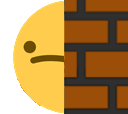

## `:blob_sad:`


## `:cowboy_peek:`


## `:dogjam:`


## `:kermit_typing:`


## `:kermit_wut:`


## `:kermit_yaaaaay:`


## `:rage_cry:`


## `:blob-wave-peek:`


## `:meow_wave_peek:`


## `:finger_guns:`
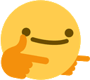

## `:finger_guns2:`


## `:sad_finger_guns:`
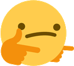

## `:sad_finger_guns2:`
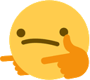

## `:meow_comfy_fingerguns:`


## `:meow_comfy_peek:`
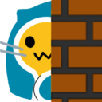

## `:anticipation:`


## `:hhhehehe:`


## `:yeet_party:`


## `:true:`


## `:party_pizza:`
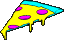

## `:pizza_wave:`
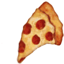

## `:party-merge:`


## `:blink:`
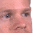

## `:doot-doot:`
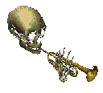

## `:cowboy-eyes:`
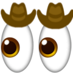

## `:cowboy-ghost:`
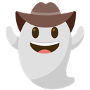

## `:pizza_peek:`
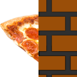

## `:peek_template:`
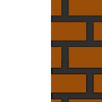

## `:pizza_activated:`
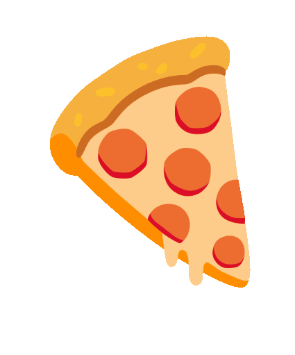
