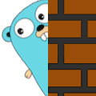
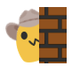
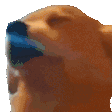
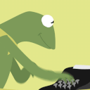
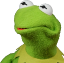

# favorite-slack-emojis
Set of my favorite slack emojis to use 🙂

### Saving gif from preview
Sometimes I edit gifs in macOS preview, but saving seems to break the looping behavior. To fix that I used `imagemagick` `convert` (`brew install imagemagick`)
```
❯ convert -loop 0 source.gif destination.gif
```

## `:gopher_peek:`


## `:blob_sad:`


## `:cowboy_peek:`


## `:dogjam:`


## `:kermit_typing:`


## `:kermit_wut:`


## `:kermit_yaaaaay:`


## `:rage_cry:`


## `:blob-wave-peek:`

